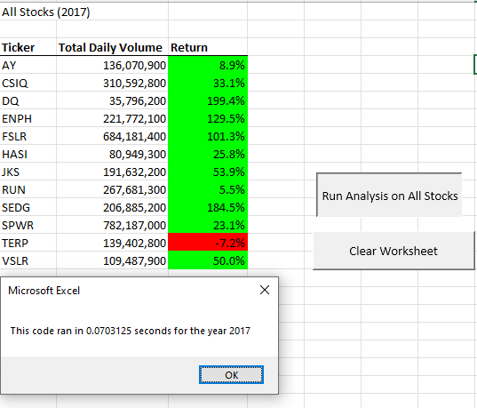

# Green Stocks Analysis

## Overview of Project

### The purpose of this project was to refactor the code that was created to evaluate the trading volume & annual return of all the stocks in a dataset. 

The VBA code was used to pull specific data from each ticker and output the total trading volume and the rate of return from the starting date to the closing date.  The script was also timed to see if it was improved to run more efficiently.

## Results

### Results of Re-factoring 2017 Code

### Results of Re-factoring 2018 Code

## Summary

Refactoring code allows a developer to begin with an existing code and make modifications or edits to either clean it up or improve. You can condense or rearrange lines without changing the functionality of the code. One disadvantage is that if the code is large, you have to be careful that any changes made are consistent so that the code does not break.

This particular script was functional at the end of the module.  When I began refactoring the code, I started getting errors because of different lines I had changed. I had to track those changes and make adjustments (for example to the way I named the index of the tickers array) in order to restore the code to working order. My original code was faster than the refactored code.
