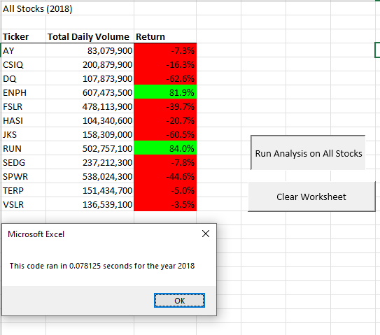

# Green Stocks Analysis

## Overview of Project

### The purpose of this project was to refactor the code that was created to evaluate the trading volume & annual return of all the stocks in a dataset. 

The VBA code was used to pull specific data from each ticker and output the total trading volume and the rate of return from the starting date to the closing date.  The script was also timed to see if it was improved to run more efficiently.

## Results

### Stock Performance
Stocks performed much better in 2017 than the following year. While FSLR would have been a great pick in 2017 with high trading volumes and significant return yields, it did not fare so well in 2018. ENPH performed consistently for both years, with an increased volume in 2018 over 2017, and returns upwards of 80% both years

### Results of Re-factoring 2017 Code
Refactored 2017

### Results of Re-factoring 2018 Code

## Summary

Refactoring code allows a developer to begin with an existing code and make modifications or edits to either clean it up or improve. You can condense or rearrange lines without changing the functionality of the code. One disadvantage is that if the code is large, you have to be careful that any changes made are consistent so that the code does not break.

This particular script was functional at the end of the module.  When I began refactoring the code, I started getting errors because of different lines I had changed. I had to track those changes and make adjustments in order to restore the code to working order. Creating an index of the tickers allowed the code to loop through once and gather the requested data from each element in the array, instead of looping through each named element to gather the information, one at a time for 12 rounds.  The resulting code was much faster!
